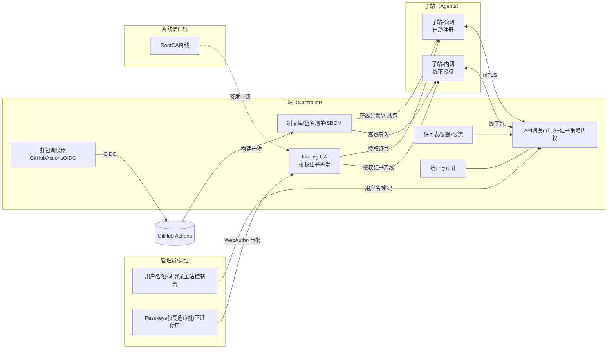
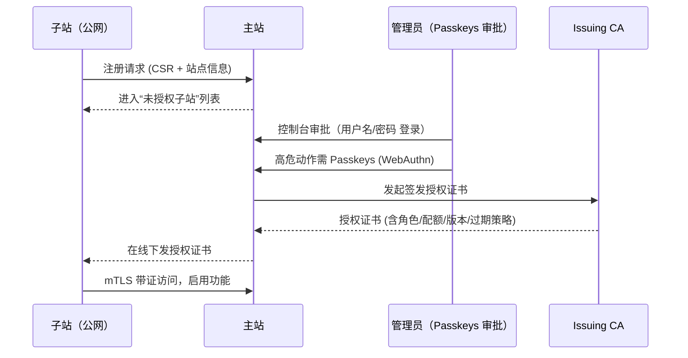
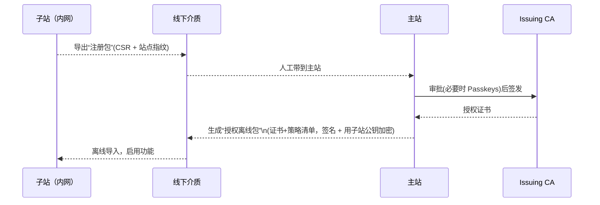
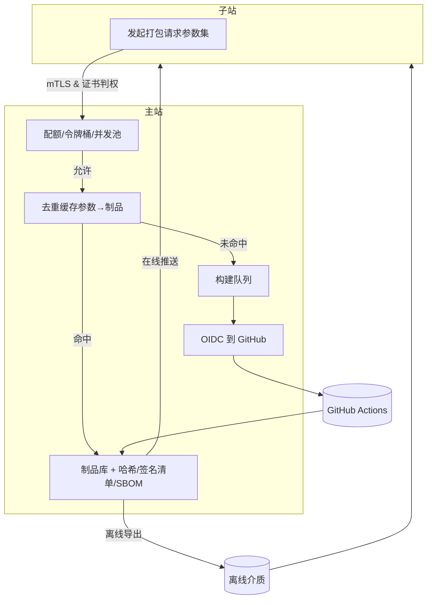
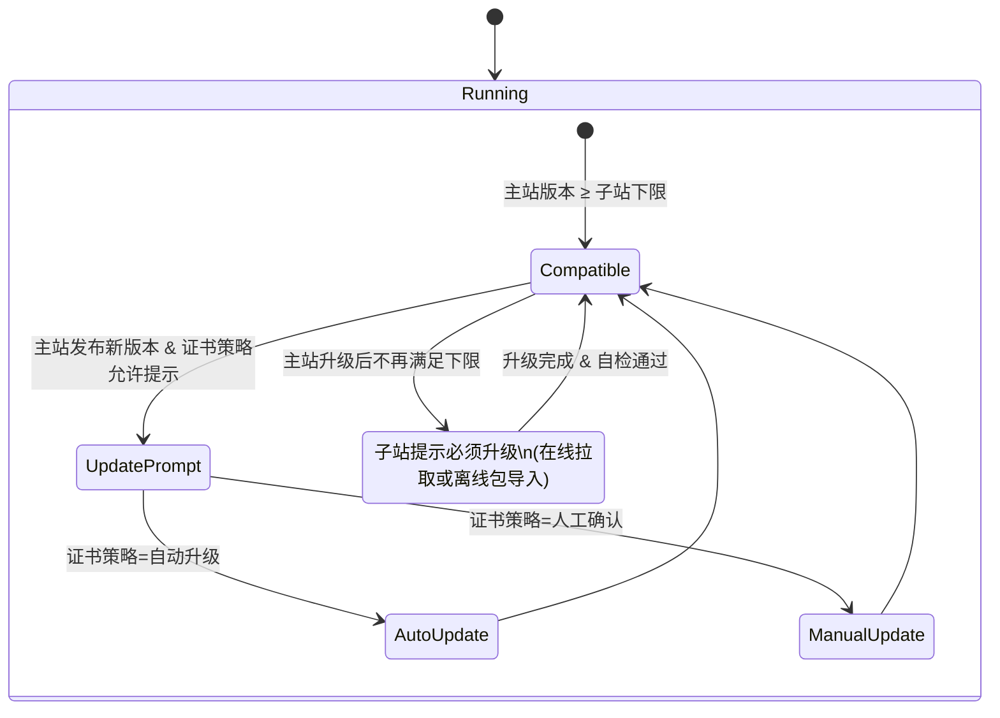
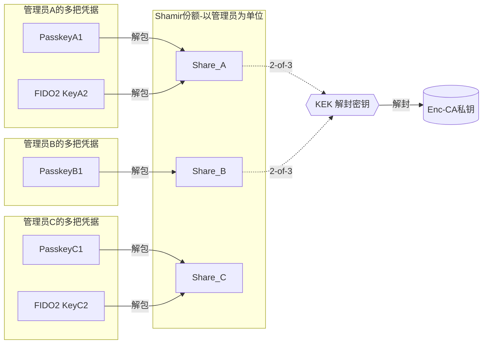
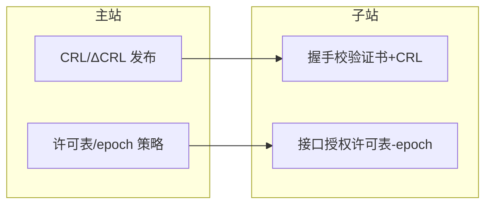
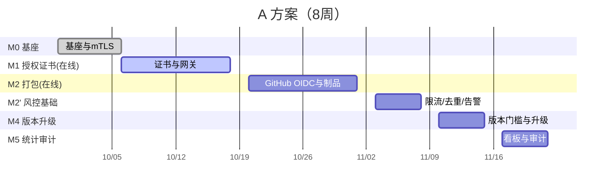
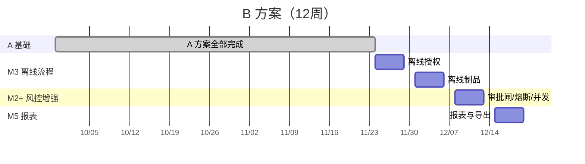
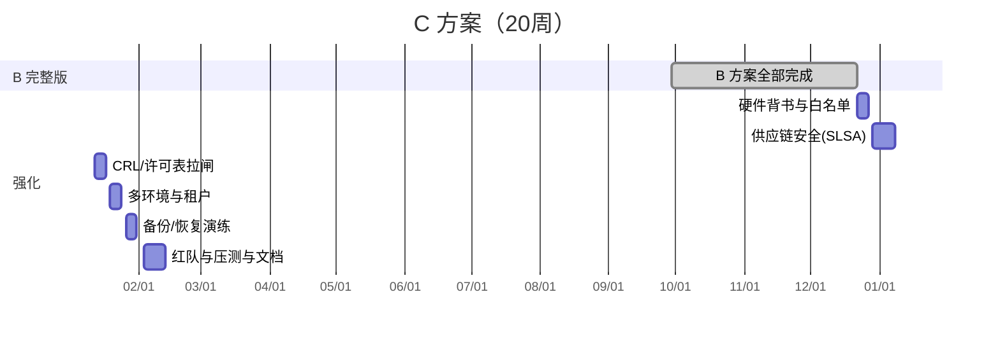

# 0. 使用说明
- 这是一套可直接用于对外讲解的可视化图集（Mermaid）。
- 覆盖：系统总览、线上/线下授权流程、打包与分发、N-of-M 审批解封模型、版本与升级、运行期管控与拉闸、里程碑甘特图。
- 讲解顺序建议：1→2→3→4→5→6→7。

---

# 1) 系统总览架构图（人/机边界与信任根）

**要点**

- 登录统一用用户名/密码；**Passkeys 只参与高危审批/下证**。
- 子站功能受**授权证书**与**API 网关策略**双重约束。
- 打包在主站统一调度，制品可在线下发或做**离线包**导入。

---

# 2) 线上注册与授权流程（公网子站）

**要点**
- 未授权子站只可上报信息；审批后才解锁功能。
- 授权证书是“硬许可证”，携带功能位/配额/版本门槛。

---

# 3) 内网线下授权流程（完全离线）

**要点**
- 离线包双重保护：**主站签名清单 + 子站公钥加密**，防篡改与错站导入。

---

# 4) 打包与分发流水线（含限流/去重）

**要点**
- **三道闸**：配额/并发、去重缓存、人工审批闸（超过阈值触发）。
- 制品全量存证（哈希/签名清单/SBOM），可复用、可追溯。

---

# 5) 版本与升级策略（主站≥子站）

**要点**
- 版本门槛来自授权证书字段（如 `version_floor`）。
- 在线/离线两路升级；失败可回滚。

---

# 6) N-of-M 审批解封模型（凭据≠份额）

**要点**
- 阈值按**份额/管理员**计（如 2-of-3），**不是凭据数量**。
- 同一份额可被多把凭据“包裹”，丢一把凭据≠丢份额。
- 解封仅在下证/高危动作瞬时进行，用毕即抹除。

---

# 7) 运行期管控与“拉闸”

**要点**
- 证书长效不代表不可控：**CRL/ΔCRL**（握手前） + **许可表/epoch**（握手后）双层控制。

---

# 8) 里程碑甘特图（一人+AI，三种方案）
## A｜在线优先版（8 周）

## B｜完整版（12 周）

## C｜高保障/合规版（20 周）

---

## 讲解小抄（每张图的“一句话”）
- **总览**：主站是策略与签发核心，子站受证书和网关双控；打包统一在主站调度。
- **线上授权**：公网子站自动注册，Passkeys 审批后在线下发证书。
- **线下授权**：注册包→授权离线包（签名+加密）→导入启用。
- **打包流水线**：令牌桶+去重+Actions+制品库，产物可在线/离线分发。
- **版本**：主站≥子站；是否升级由证书策略决定。
- **N-of-M**：凭据是钥匙，份额是票；2-of-3 解封 KEK，私钥仅瞬时在内存。
- **拉闸**：长效证书 + CRL/ΔCRL + 许可表，实现分钟级停/放行。

