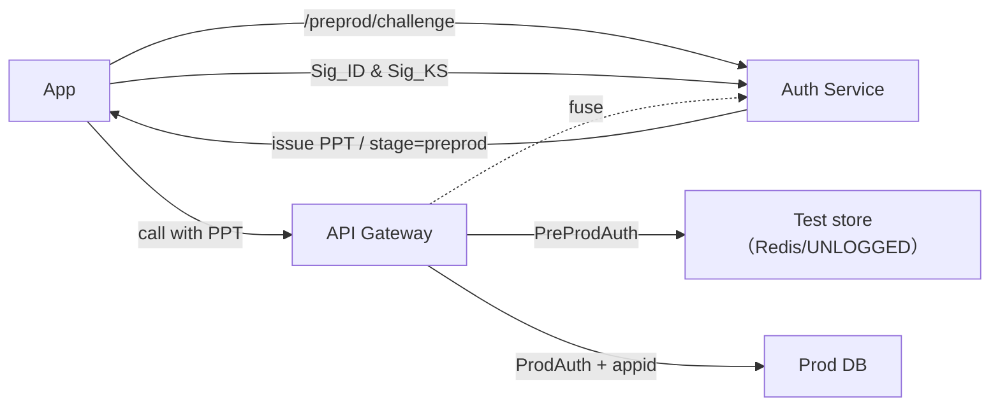

> 适用场景：整机交付、每应用唯一 appid、接口与设备/应用强绑定；设备处在**正式网络/已授权**环境，但仍需**无 appid 的测试体验**，且**绝不**把测试数据带入证书（生产）环境。

# 1. 目标与边界
- 无需输入 appid 即可跑通“测试流”。
- 强抗设备伪造：拒绝 deviceId 冒用、模拟器/二次打包。
- 测试与生产双隔离：鉴权、能力、数据面三道栅栏。
- 测试数据天然易失、到期自毁，物理+逻辑双保险，不能迁入生产。
- 支持高并发压测与观察性建设。

# 2. 术语
- **KeyChain 身份钥（ID key）**：系统凭据库中的长期身份密钥，可跨卸载保留（用户不手动清除时）。
- **Keystore 会话钥（KS key）**：Android Keystore/KeyMint 生成的短期密钥，配合 Key Attestation/Play Integrity 做持有性证明（PoP）。
- **PoP**：Proof-of-Possession，服务器随机挑战 + 客户端签名回应。
- **AEAD**：SM4-GCM/CCM 等带完整性校验的对称加密模式。
- **PPT（Pre-Prod Token）**：预生产令牌，`stage=preprod`，仅测试白名单能力。
- **Poison bit**：测试数据毒丸位，生产路径硬拒绝。

# 3. 总体架构

- 同一网关可同时承载生产与预生产；通过令牌语义区分。
- PreProdAuth 强制路由到测试数据面；ProdAuth 仅在 `stage=prod + appid 绑定` 时放行。

# 4. 设备伪造对抗：KeyChain + Keystore + PoP
**注册/绑定（或重装后重新绑定）**
1. `/preprod/challenge` 返回一次性 nonce。
2. 客户端：
   - 选择/生成 **KeyChain 身份钥** 得到 `ID_pub`；
   - 生成 **Keystore 会话钥** 得到 `KS_pub`，并取 Attestation（把 `nonce` 放入挑战字段）；
   - 用 ID 私钥签名 `hash(nonce || KS_pub || app_pkg || device_fp)` 得 `Sig_ID`；
3. 服务器验证 Attestation → 验证 `Sig_ID` → 记录 `(ID_pub_fp, KS_pub_fp, app_pkg, device_fp)` 绑定。

**调用时 PoP**
- 每次 `/preprod/token` 与关键接口 `/prove`：同时携带 `Sig_ID`（长期身份）与 `Sig_KS`（实时环境）。
- 二者皆验通过才签发/放行。

# 5. 令牌设计：PPT（在正式网络内的受控测试）
- 签发端使用独立 `kid=pp-key`，与生产 `kid=prod-key` 分离。
- 载荷示例：
```json
{
  "iss": "auth", "aud": "api", "sub": "device:<fp>",
  "stage": "preprod",
  "app_pkg": "com.xxx.yyy", "app_sig": "<cert-digest>",
  "caps": ["cfg.read","encrypt.demo","status.ping"],
  "tenant": "TST::<device-fp>",
  "cnf": {"jwk":"<KS_pub_fingerprint>"},
  "iat": 1730358000, "exp": 1730360
}
```
- **不含 appid**；`stage=preprod` 必须存在；`tenant` 由服务器强制设定。

# 6. 网关与服务执法
**PreProdAuth（测试流）**
- 只接受 `kid=pp-key` 且 `stage=preprod`。
- 校验 caps 白名单；在 DAO 层**强制** `tenant="TST::<...>"`。
- 写操作永远路由到**测试易失面**（见 §7）。

**ProdAuth（生产流）**
- 只接受 `kid=prod-key` 且 `stage=prod`。
- 必须携带 `appid`，且 `(device, appid)` 有绑定关系；才路由到生产库。

**保险丝（Fuse）**
- 当设备完成 appid 绑定/正式上线，写 `fuse_preprod_disabled=true`：
  - `/preprod/challenge|token` → 403 `SBX_FUSED`；
  - 客户端转走生产流。

# 7. 测试数据：易失性+不可迁移
## 7.1 易失存储（推荐 Redis on tmpfs）
- 独立 Redis，关闭持久化：
```conf
# redis.conf (preprod)
save ""
appendonly no
maxmemory 8gb
maxmemory-policy allkeys-lru
```
- Key 形如：`preprod:<pkg>:<device-fp>:<uuid>`，所有写入带 TTL（`SETEX`/`EXPIRE`）。
- 可选：PostgreSQL UNLOGGED/临时表 + 分区 `DROP PARTITION`。

## 7.2 阶段密钥 + AAD 绑定（Stage-Sealed Envelope）
- KMS 中两套主密钥：`K_MASTER_PROD`、`K_MASTER_PREPROD`。
- 预生产密钥短周期轮换，内存驻留：`K_PREPROD_EPOCH = HKDF(K_MASTER_PREPROD, "preprod-epoch" || epoch_ts)`。
- 使用 SM4-GCM；AAD 含：`stage="preprod"`, `poison=1`, `app_pkg`, `app_sig`, `epoch`, `schema_ver`。
- 信封示例：
```json
{
  "hdr": {"stage":"preprod","poison":1,"app_pkg":"...","app_sig":"...","epoch":1730358000,"schema_ver":3},
  "iv":"...","ct":"...","tag":"..."
}
```
- 生产路径：只接受 `stage=prod` 且 `poison=0`，否则直接拒绝，不尝试解密。

## 7.3 逻辑衰减与到期自毁
- T0 写入：`poison=1`；采用预生产密钥与 AAD 绑定。
- T0+30m：后台 **Shredder** 裁剪大字段/脱敏（保持可诊断，破坏可迁移性）。
- T0+TTL（如 24h）：预生产 epoch 密钥销毁 + Redis TTL 清理；双保险。

# 8. 压测方案（k6/Vegeta）
- 切断外部依赖：Attestation/Integrity 走 MOCK 实现，保留结构解析开销。
- 预置 N 组“设备夹具”（`ID_pub/KS_pub`、假 attestation、预签名/服务端模拟签名）。
- 负载形态：阶梯、突刺、长稳；观测 p99/p999、失败分类、签名验证耗时。

**k6 脚本骨架**
```javascript
import http from 'k6/http'; import { check, sleep } from 'k6';
export const options = { stages:[{duration:'30s',target:200},{duration:'2m',target:200},{duration:'30s',target:1000},{duration:'3m',target:1000},{duration:'30s',target:0}] };
export default function() {
  let c = http.post(__ENV.BASE+'/preprod/challenge', '{}', { headers: {'Content-Type':'application/json'} });
  let obj = c.json(); let nonce = obj.nonce, session_id = obj.session_id;
  // 这里使用预签名/服务端模拟签名
  let res = http.post(__ENV.BASE+'/prove', JSON.stringify({ session_id, ctx:'deadbeef', sig_id:'...', sig_ks:'...' }), { headers: {'Content-Type':'application/json'} });
  check(res, { 'prove 200': r => r.status===200 }); sleep(Math.random()*0.2);
}
```

**Vegeta（热路径）**
```bash
echo 'POST https://api.example.com/prove
Content-Type: application/json

{"session_id":"...","ctx":"...","sig_id":"...","sig_ks":"..."}' | vegeta attack -duration=2m -rate=2000 | vegeta report
```

# 9. 关键代码片段
**Go：鉴权中间件**
```go
func PreProdAuth(next http.Handler) http.Handler {
  return http.HandlerFunc(func(w,r *http.Request){
    tok, err := parseJWT(r, keySetPP)
    if err != nil || tok.Claim("stage") != "preprod" { deny(w,401); return }
    if fuseDisabled(tok.Subject) { denyMsg(w,403,"SBX_FUSED"); return }
    if !capsAllowed(tok, r.URL.Path) { deny(w,403); return }
    ctx := withTenant(r.Context(), "TST::"+deviceFP(tok.Subject))
    next.ServeHTTP(w.WithContext(ctx), r)
  })
}

func ProdAuth(next http.Handler) http.Handler {
  return http.HandlerFunc(func(w,r *http.Request){
    tok, err := parseJWT(r, keySetProd)
    if err != nil || tok.Claim("stage") != "prod" { deny(w,401); return }
    appid := r.Header.Get("X-App-Id")
    if !bindingExists(tok.Subject, appid) { deny(w,403); return }
    next.ServeHTTP(w, r)
  })
}
```

**Java：SM4-GCM 验证**
```java
Cipher c = Cipher.getInstance("SM4/GCM/NoPadding","BC");
GCMParameterSpec spec = new GCMParameterSpec(128, iv);
c.init(Cipher.DECRYPT_MODE, new SecretKeySpec(k, "SM4"), spec);
c.updateAAD(aad); c.doFinal(ct_and_tag); // 通过即密钥/参数正确
```

**Go：预生产密钥轮换（伪代码）**
```go
func derivePreprod(now time.Time) {
  for _, e := range epochsAround(now, 4) {
    keys[e] = HKDF(K_MASTER_PREPROD, []byte("preprod-epoch|"+e.String()))
  }
  purgeOldEpochs()
}
```

# 10. 运维与安全要点
- PPT 短 TTL（10–30 分钟）、限流与并发上限；cap 最小授权。
- 影子/干跑策略：预生产写操作默认 dry-run 或落影子表/队列。
- 审计：所有 `stage=preprod` 写操作进入独立审计表，promote 生成差异报告。
- 保险丝：一旦上线，永久禁止 `/preprod/*`；客户端隐藏测试入口。

# 11. FAQ
- **能否完全离线测试？** 可提供离线 PPT（自签根 TEST-ROOT）仅打内环接口；一旦上线即删除根证书并吹掉 fuse。
- **没有 KeyChain 时怎么办？** 企业设备用 DPM 安装密钥；普通设备引导用户在“加密与凭据”手工导入 PKCS#12；或退化仅 Keystore + Integrity。
- **历史 SM4 密文如何判断来源？** 无 MAC/Tag 难以证明。自现在起采用 AEAD 或“加密后再 MAC”，并把 AAD 绑定设备/阶段。

# 12. 落地清单
- [ ] 网关：`PreProdAuth`/`ProdAuth` 中间件、kid 区分、caps 白名单。
- [ ] Auth：`/preprod/challenge|token`、PPT 签发、PoP 验证、保险丝。
- [ ] DAO：preprod 强制路由到 Redis/UNLOGGED；生产严格拒绝 `poison=1`。
- [ ] KMS：`K_MASTER_PROD`/`K_MASTER_PREPROD` 管理与轮换；epoch 内存键派生。
- [ ] 后台任务：Shredder 衰减、TTL 守护、epoch 键清理。
- [ ] 压测：设备夹具与 MOCK 验证、k6/Vegeta 脚本、指标与告警。
